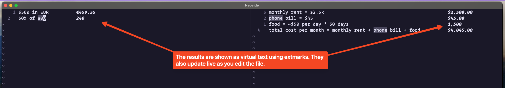

# soulver-viz.nvim

## Screenshot



## Config

```lua
require('soulver-viz').setup({
   live = true, -- whether to enable live execution by default
   path = "~/bin/soulver", -- specifying path is important
});
```

## Usage

Commands:

- `:SoulverVizOn` - enable live execution of the soulver files
- `:SoulverVizOff` - disable live execution of the soulver files
- `:SoulverViz`  - execute the current buffer
- `:SoulverVizStatus` - shows whether live execution is on, and what is the path of the soulver binary
